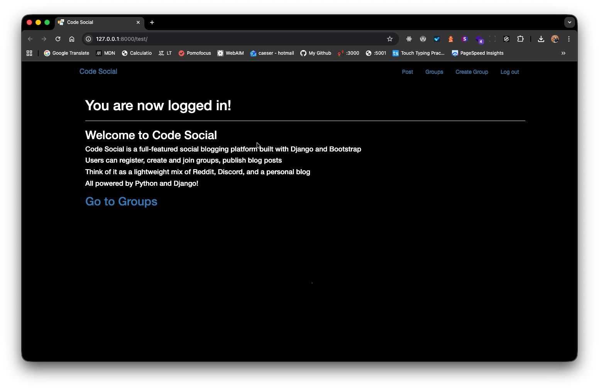
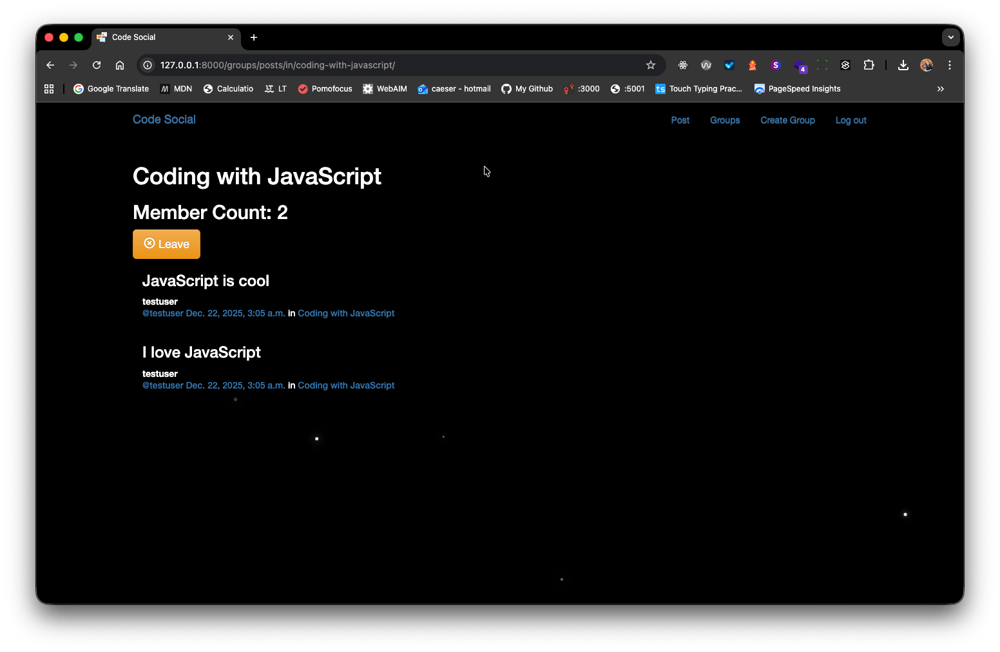

# Code Social

**Code Social** is a full-featured social blogging platform built with **Python**, **Django** and **Bootstrap**. Users can register, create and join groups, publish blog posts, and interact with others in a community-driven environment.

Think of it as a lightweight mix of **Reddit**, **Discord**, and a personal blog — all powered by Python and Django!

  
  
  

## <link rel="icon" type="image/png" href="/static/simplesocial/images/favicon.png">

## ✨ Features

- 🔐 **User Authentication**
  - Sign up, log in, and log out
  - Secure password handling (via Django’s built-in auth)
- 👥 **Group System**
  - Create new groups
  - Browse and join existing groups
  - Leave groups anytime
- ✍️ **Blogging**
  - Post blogs inside groups
  - View posts from other members
  - Clean, readable post formatting
- 🎨 **Responsive UI**
  - Built with **Bootstrap 5** for mobile-friendly design
  - Clean, modern interface

---

## 🛠️ Technologies Used

- **Backend**: Python 3.10+, Django 5.2
- **Frontend**: HTML5, CSS3, Bootstrap
- **Database**: SQLite (ideal for development)
- **Authentication**: Django’s built-in `auth` system
- **User Management**: Custom user profiles and group memberships

---

## 🚀 Getting Started

### 💡 How It Works

Every post belongs to a group.
Users must join a group to see its posts or create new ones.
Only group members can post in that group.
All authentication is handled securely using Django’s best practices.

### 🔒 Security Notes

Passwords are hashed (never stored in plain text).
User sessions are managed by Django’s secure session framework.
Always use HTTPS in production (not needed in development).

### 📜 License

This project is for educational and personal use. Feel free to learn, modify, and build upon it!

### Made with ❤️ by Caeser Ibrahim
